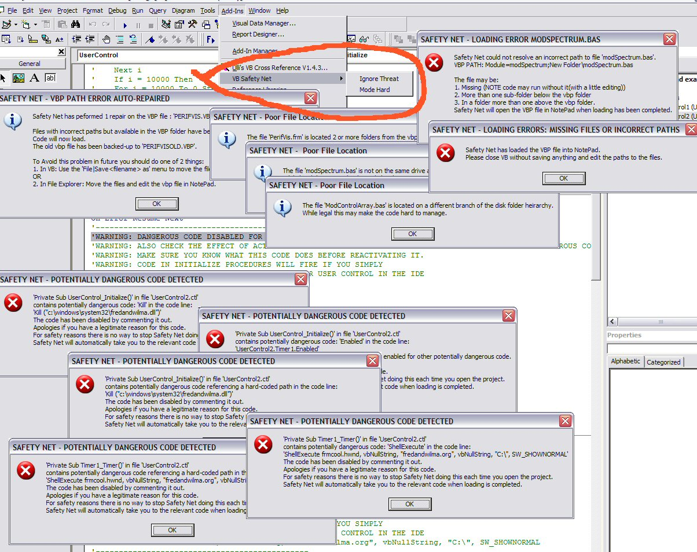



## VB Safety Net \(1\.4\)

### Description

This Add-in combines 2 services.

----

1. VPB FilePath correction:

For all those uploads that have the files but give you file missing messages when you load them. This fix searchs for missing files in the vbp file's folder, sub-folders and immediate neighbour folders (Sub folders of one folder above the vbp folder) and if it finds them rewrites the vbp path. If it can't find the file it loads the vbp into NotePad and suggests what to do.

For your own projects it warns you if any of the files are unnecessarily distant from the rest of the project.

----

2. Malicious Automatic Code detection/blocking:

Searchs the automatic launch procedures (those that VB can fire before you can even look at them) for code that may be able to attack your computer. This code is commented out before it can load. Also searches for hard-coded paths that may be used to attack EG "C\Windows\Systetm32\...". If suspicious code is detected it is commented out and VB will jup to the relevant position once the code has loaded.

----

How it works:

using FileControlEvents you can create a sub 'BeforeLoadFile' that intercepts filenames, while you cannot stop it loading you can open the file, inspect and modify it before it appears in the IDE.

----

NOTE the add-in has no interface, it is designed to run silent unless you load code that triggers any of the messageboxs shown below.

----

IMPROVED:

1.2 Sub-Menu added to allow you to turn off the more intense search that bugs so many.

Added a USING SAFETY NET.txt to the zip with more details of how to use Safety Net.

----

1.1

You can now mark suspicious code as safe.

On the Add-in menu you will find an entry 'VB Safety Net OK Stamp' simply place the cursor above the line you wish to protect and click the menu entry.

'SAFETY NET OK by &lt;RegisteredName&gt; &lt;Date&gt; &lt;Time&gt;

This safety mark depends on your windows registered name so only works on your machine, on other machines the protective comment has no value. This prevents someone creating an attack that will be passed by Safety Net by protecting their nasty. (Well, if they know your registered name they could build a one-off attack)

----

apologies for the path bug that reported vbp fiolder files as being in thewrong place (fixed)

UPDATE 1.3

1 The Ignore Threat message has been changed so that its meaning is clearer:

SAFETY NET Ignore Threat OK by &lt;Windows_Registered_User_Name&gt; &lt;Date&gt; &lt;Time&gt;

2 The Ignore Threat message is now inserted when Safety Net disables suspicous code.

You can mark the code as safe simply by uncommenting the code and leaving the Ignore Threat comment in place.

3 removed some unnecessary code.

4 do'h forgot about the VBP Parent folder

1.4

Tightened up some of the code for path detection.
 
### More Info
 

             |
---                |---
**Submitted On**   |2005-08-16 21:50:04
**By**             |[Roger Gilchrist](https://github.com/Planet-Source-Code/PSCIndex/blob/master/ByAuthor/roger-gilchrist.md)
**Level**          |Advanced
**User Rating**    |5.0 (45 globes from 9 users)
**Compatibility**  |VB 6\.0
**Category**       |[Coding Standards](https://github.com/Planet-Source-Code/PSCIndex/blob/master/ByCategory/coding-standards__1-43.md)
**World**          |[Visual Basic](https://github.com/Planet-Source-Code/PSCIndex/blob/master/ByWorld/visual-basic.md)
**Archive File**   |[VB\_Safety\_1924548162005\.zip](https://github.com/Planet-Source-Code/roger-gilchrist-vb-safety-net-1-4__1-61730/archive/master.zip)

